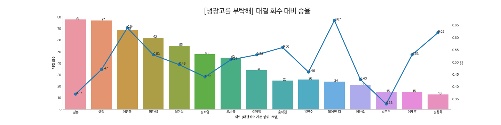
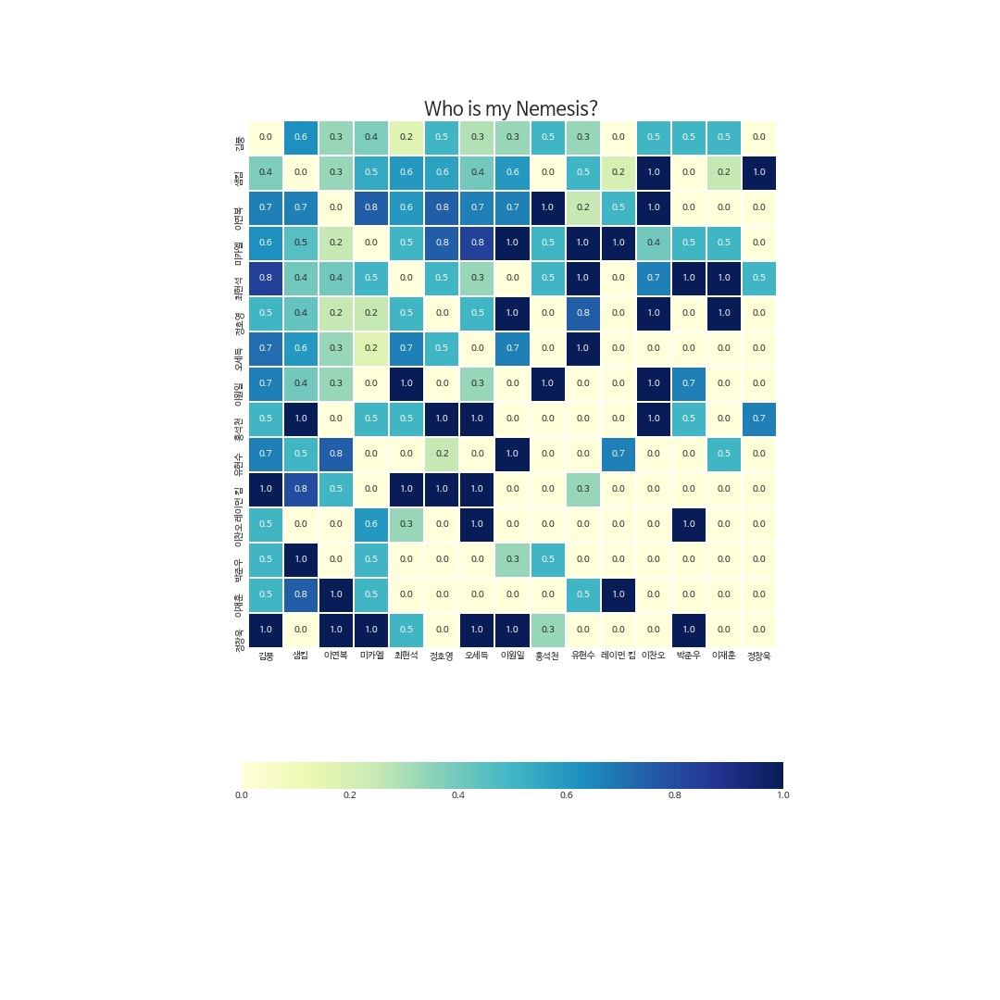

## NBH(냉장고를 부탁해) Data Exploration - Result Summary
NBH is a term coined by the author to refer to the show, "Please Take Care of My Refrigerator", which losely translates to Naeng Bu Hae in Korean.

### About the chefs
I used my best friend, Wikipedia to get information on the match results. I am interested in the following questions

### Who has the highest winning probability?
Who is my nemesis?
#### Match frequency against winning probability
There were total of 31 chefs who have cooked at least once on the show. 

Not everyone is a regular (some were visiting chefs from other countries) so I have looked at top 15 chefs (sorted by number of matches). 

Chef's face photo source: JTBC "Please Take Care of My Refrigerator" program homepage and Google Image search. Please let me know if I need to take any of them down.
<br/ >
<br/ >
It looks like Kim Poong is out in the battle field the most, with a low winning rate.
For those who may not know who Kim Poong is, he is a famous webcomic artist. He is the only non-professional contestant on the show.

#### Who is my nemesis?
Now it is time to look at each chef's strongest and weakest opponents. The following heatmap's each row represents the chef's (name on the left) match history against each opponent. For example, chef Lee,Yeon-bok (third from the top) has one over Kim, Poong 70% of the time, and Mihal 90% of the time.
