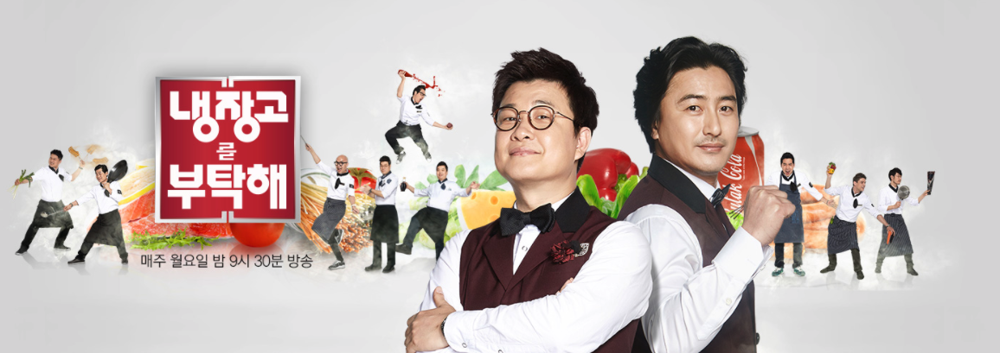

# Predicting the next winner for "Please Take Care of My Refrigerator"
A famous Korean reality cooking competition show (on air since Nov. 2014)
[냉장고를 부탁해] 위너(winner) 쉐프 예측 모델

## Who can predict which chef will win the next cook battle?
No one? I will give it a try.

## About this repository
Predict which contestant will win in a TV show, featuring two famous professional chefs on the next cook-off.

## About the show
[냉장고를 부탁해](https://ko.wikipedia.org/wiki/%EB%83%89%EC%9E%A5%EA%B3%A0%EB%A5%BC_%EB%B6%80%ED%83%81%ED%95%B4), is a cooking-variety TV program starring various chefs and having celebrity guests every week. Its title in English translates to, "Please Take Care of My Refrigerator", but for simplicity, I will refer to it as **NBH**, which is the first alphabet from its abbreviated nickname, *Naeng Bu Hae*. Please check out this [link](https://en.wikipedia.org/wiki/Please_Take_Care_of_My_Refrigerator) for more explanation from Wikipedia.

## How to use
### Part 1: What are we working with?
Data exploration

### Part 2: Where to put my money on?
Prediction

Image source: Downloaded from [JTBC "Please Take Care of My Refrigerator" program homepage](http://tv.jtbc.joins.com/janggo). 